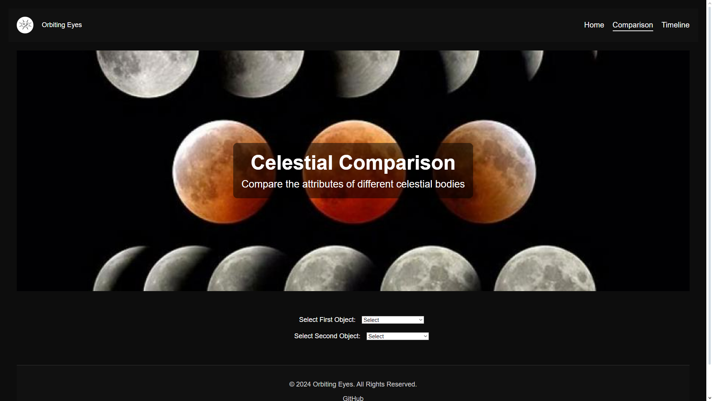
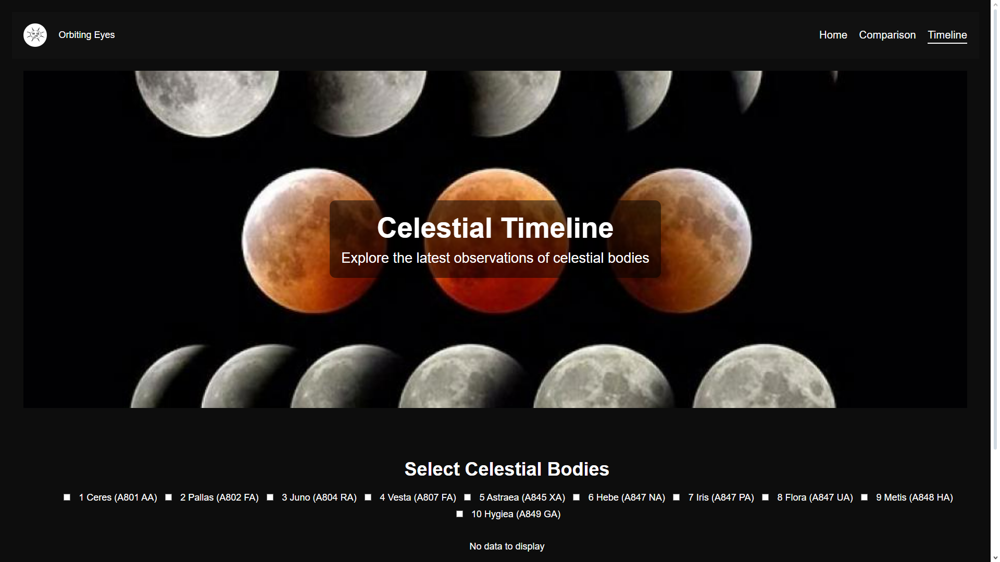

# Orbiting Eyes

Orbiting Eyes is an application that displays information on celestial bodies using the Horizons API from the NASA website. This project aims to provide users with detailed and up-to-date data about various astronomical objects.

## Table of Contents
- [Installation](#installation)
- [Usage](#usage)
- [Features](#features)
- [Screenshots](#screenshots)
- [License](#license)

## Installation

To get started, clone the repository and install the dependencies:
- git clone https: https://github.com/MichaelaKemp/231001_michaela-kemp_semester-1-assessment.git 
- cd orbiting-eyes
- npm install

## Usage

To run the app in development mode:
- Copy code
- npm start
- Open http://localhost:3000 to view it in your browser. The page will reload when you make changes. You may also see any lint errors in the console.

To run tests:
- Copy code
- npm test

To build the app for production:
- Copy code
- npm run build
- This will create an optimized production build in the build folder.

## Screenshots

- Home Page

- Comparison Page

- Timeline Page

## Features

Celestial Body Information: Search and view detailed information about celestial bodies.

Horizons API Integration: Fetches data directly from NASA's Horizons API.

User-Friendly Interface: Intuitive interface designed for easy navigation and data presentation.

## License
This project is licensed under the MIT License. See the LICENSE file for details.

